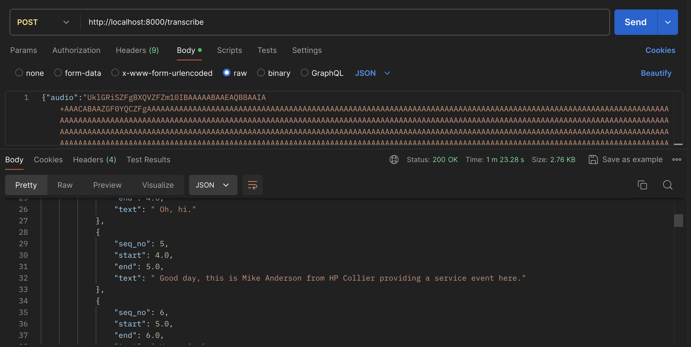

## About
This is a repository for building a Transcription API using Open AI Whisper. You can use the code freely and modify it too, however, the transcription accuracy and other aspects of deploying Gen AI application need to be taken care by the Developer before using this in a production application. The wav files in the sound directory are downloaded from the internet, it is used only for this demo and not for any commercial purposes.

## Building the Docker container

From the whisper-docker directory,

**docker build -t whisper-app-transcriptions .**

## Starting the API
**docker run -p 8000:8000 whisper-app-transcriptions**

## Testing the API

